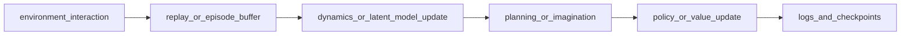

# Advanced Algorithms (Phase 3)

Phase 3 contains custom model-based/planning-heavy implementations. For **full mathematical and architectural detail** (per paper), see [`algorithms/index.md`](algorithms/index.md).

Detailed pages:

- [Dreamer](algorithms/dreamer.md)
- [MuZero](algorithms/muzero.md)
- [PETS](algorithms/pets.md)
- [MBPO](algorithms/mbpo.md)
- [PlaNet](algorithms/planet.md)
- [TD-MPC](algorithms/tdmpc.md)
- [TD-MPC2](algorithms/tdmpc2.md)
- [World Models](algorithms/world_models.md)
- [I2A](algorithms/i2a.md)
- [MVE](algorithms/mve.md)
- [STEVE](algorithms/steve.md)

## Paradigm comparison chart

| Algorithm | Paradigm | Main model | Action selection | Data source |
|---|---|---|---|---|
| Dreamer | latent world model RL | RSSM + actor/critic | policy in imagination | real episodes + imagined rollouts |
| MuZero | learned model + search | repr/dyn/pred nets | MCTS | self-play trajectories |
| PETS | model-based MPC | ensemble dynamics | CEM planning | real replay |
| MBPO | model-based policy optimization | ensemble dynamics + SAC | learned policy | real + short synthetic rollouts |
| PlaNet | latent planning | pixel encoder + RSSM | latent CEM | episodic pixel replay |
| TD-MPC/2 | latent/model-based control | dynamics + value + policy | CEM with value backup | transition replay |
| World Models | latent sequence modeling | VAE + recurrent model + controller | controller logits | pixel episodes |
| I2A | imagination-augmented policy | learned env model + rollout encoder | policy over real + imagined features | transition replay |
| MVE/STEVE | model-based value targets | ensemble dynamics + value net | policy/value update | transition replay |

## Global Phase 3 dataflow



## Implementation anchors

- Advanced trainers: `src/rl_experiments/advanced/**/**_agent.py`
- Shared modules: `src/rl_experiments/advanced/common/`
- Dispatch: `src/rl_experiments/api/registry.py`

## Code segment examples

```python
# Dreamer dispatch
agent = DreamerAgent(cfg.env_id, seed=cfg.seed)
agent.train(n_episodes=eps, run_id=rid)
```

```python
# TD-MPC variant switch
horizon = 8 if variant == "tdmpc2" else 5
gamma = 0.995 if variant == "tdmpc2" else 0.99
```
