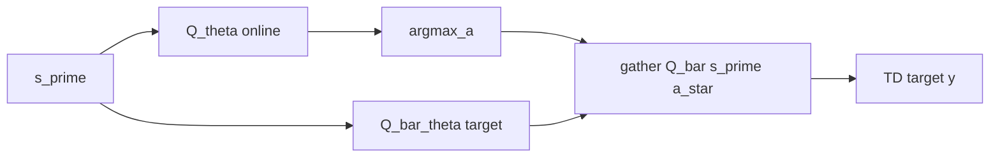

# Double DQN

## 1. Overview

**Double DQN** (van Hasselt et al., 2015) addresses **overestimation bias** in vanilla DQN: using $\max_{a'} Q_\theta(s',a')$ for both selecting and evaluating the maximizing action tends to prefer noisy high values. Double DQN **decouples selection and evaluation** using the online network for $\arg\max$ and the target network for the value of that action.

Implementation: [`train_dqn_variant(..., "double_dqn")`](../../src/rl_experiments/baselines/dqn_variants.py) via [`double_dqn_experiment.py`](../../src/rl_experiments/baselines/double_dqn_experiment.py).

---

## 2. Problem setting

Let $Q_\theta$ be online and $Q_{\bar{\theta}}$ target. The **Double Q-learning** target is:


$$
y = r + (1-\text{done})\,\gamma\, Q_{\bar{\theta}}\big(s',\, \arg\max_{a'} Q_\theta(s', a')\big).
$$


This differs from DQN’s:


$$
y_{\text{DQN}} = r + (1-\text{done})\,\gamma\, \max_{a'} Q_{\bar{\theta}}(s', a'),
$$


where the same network (target) both ranks and evaluates actions, amplifying upward bias.

---

## 3. Intuition

- If $Q_\theta$ overestimates some actions due to function approximation noise, taking $\max_{a'} Q_{\bar{\theta}}(s',a')$ at that noisy argmax inflates targets. **Selecting** with $\theta$ but **evaluating** with $\bar{\theta}$ at the selected action reduces this coupling.

---

## 4. Mathematical formulation (scalar Q)

For n-step returns with horizon $n$ (here $n=1$ for Double-only mode):


$$
y = r^{(n)} + (1-\text{done})\,\gamma^n\, Q_{\bar{\theta}}(s', a^*), \quad a^* = \arg\max_{a'} Q_\theta(s', a').
$$


Loss: $\text{SmoothL1}(Q_\theta(s,a), y)$ with prioritized weights if PER is enabled (Double-only uses uniform replay when `is_per` is false for that variant).

---

## 5. Architecture



**Network:** `QNetwork` MLP with optional dueling (off for `double_dqn` alone).

---

## 6. Code anchor

From [`dqn_variants.py`](../../src/rl_experiments/baselines/dqn_variants.py):

```python
next_a = net(b_nobs).argmax(dim=1, keepdim=True)
next_q = tgt(b_nobs).gather(1, next_a).squeeze(1)
target = b_rew + (1.0 - b_done) * (cfg.gamma ** n_step) * next_q
```

---

## 7. Hyperparameters

Uses `VariantConfig` defaults unless overridden: learning rate $10^{-4}$, batch 128, target update every 1000 steps, Huber loss per SB3-style smoothing.

---

## 8. References

1. van Hasselt, H., Guez, A., & Silver, D. (2015). *Deep Reinforcement Learning with Double Q-learning.* AAAI.
2. Sutton, R. S., & Barto, A. G. (2018). *Reinforcement Learning: An Introduction* (2nd ed.) — Double Q-learning background.

---

## Appendix: Pseudocode and formal notes

Notation: [`00_notation_and_conventions.md`](00_notation_and_conventions.md).

### A. Pseudocode (decoupled selection and evaluation)

```text
Given online Q_θ and target Q_θ̄ (or twin networks as in paper variants)
For each TD target:
  a* ← argmax_a′ Q_θ(s′,a′)           // selector uses online / proposal net
  y ← r + γ Q_θ̄(s′,a*)               // evaluator uses target net
Update θ toward minimizing (Q_θ(s,a) − y)^2
```

### B. Assumptions (informal)

**A1.** The **maximizer** $a^*$ is computed under one estimator and evaluated under another, reducing **overestimation** from $\max_a Q(s',a)$ when errors are positively correlated.

**A2.** Same caveats as DQN: replay non-stationarity and function approximation break classical tabular convergence proofs.

### C. Remarks

- Double DQN does **not** remove all bias; it targets a known pathology of **max + bootstrap** in deep Q-learning.
- N-step returns (if used in this codebase variant) trade bias and variance along trajectories.
