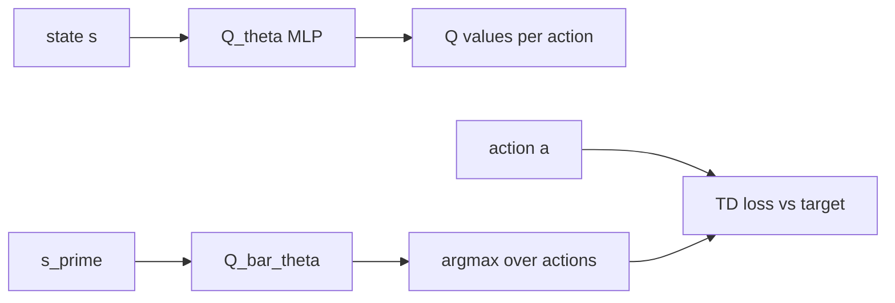

# Deep Q-Network (DQN)

## 1. Overview

**Deep Q-Network** (Mnih et al., 2015) approximates the optimal action-value function $Q^*(s,a)$ with a neural network $Q_\theta(s,a)$, using **experience replay** to break correlation and a **target network** $Q_{\bar{\theta}}$ to stabilize bootstrap targets. It applies to **discrete** action spaces.

This repository uses **Stable-Baselines3** `DQN` in [`dqn_experiment.py`](../../src/rl_experiments/baselines/dqn_experiment.py), with an **MLP** encoder suited to vector observations (CartPole, LunarLander), not Atari CNNs.

---

## 2. Problem setting

The optimal Q-function satisfies the **Bellman optimality equation**:


$$
Q^*(s,a) = \mathbb{E}\big[r + \gamma \max_{a'} Q^*(s',a') \mid s,a\big].
$$


DQN minimizes the temporal-difference error between $Q_\theta(s,a)$ and a **bootstrapped target** using the target network for $\max_{a'} Q_{\bar{\theta}}(s',a')$.

---

## 3. Intuition

- **Replay buffer**: past transitions are reused many times, improving sample efficiency.
- **Target network**: periodically copying $\theta \to \bar{\theta}$ prevents moving-target instability when bootstrapping from the same network.
- **$\epsilon$-greedy**: balances exploration early and exploitation late.

---

## 4. Mathematical formulation

### 4.1 Q-learning target

For a transition $(s,a,r,s',\text{done})$, one-step target:


$$
y = r + (1-\text{done})\,\gamma \max_{a'} Q_{\bar{\theta}}(s', a').
$$


### 4.2 Loss

Huber (smooth L1) loss is standard in SB3 DQN:


$$
L(\theta) = \mathbb{E}\big[\text{Huber}(Q_\theta(s,a) - y)\big].
$$


### 4.3 Target update

Hard update every $C$ steps: $\bar{\theta} \leftarrow \theta$ (SB3 uses `target_update_interval` with `tau=1` for hard updates in this config).

---

## 5. Architecture



**Policy network:** `MlpPolicy` with `net_arch: [64, 64]`, ReLU.

---

## 6. Implementation in this repository

| Item | Location |
|------|----------|
| Runner | `run_dqn()` in [`dqn_experiment.py`](../../src/rl_experiments/baselines/dqn_experiment.py) |
| Config | `DQN_CONFIG` |
| Dispatch | `_train_dqn()` in [`registry.py`](../../src/rl_experiments/api/registry.py) |

```python
model = DQN(
    policy="MlpPolicy",
    env=env_id,
    device=device,
    seed=seed,
    tensorboard_log="logs/tensorboard/dqn",
    **DQN_CONFIG,
)
```

---

## 7. Hyperparameters (this repo)

| Key | Value | Notes |
|-----|-------|--------|
| `learning_rate` | $10^{-4}$ | Adam (Nature paper used RMSProp for Atari) |
| `buffer_size` | 50,000 | Smaller than Atari 1M |
| `batch_size` | 32 | Matches common small-env setting |
| `target_update_interval` | 1000 | Hard target sync |
| `train_freq` | 4 | Env steps per gradient step |
| `exploration_fraction` | 0.1 | Fraction of training for $\epsilon$ decay |
| `exploration_final_eps` | 0.05 | Final $\epsilon$ |

---

## 8. Differences vs Nature DQN

- **Observations:** vector MLP vs convolutional stack for raw pixels.
- **Optimizer:** Adam vs RMSProp.
- **Replay size:** reduced for memory and runtime on classic control.

---

## 9. References

1. Mnih, V., et al. (2015). *Human-level control through deep reinforcement learning.* Nature 518, 529–533.
2. Stable-Baselines3: [DQN](https://stable-baselines3.readthedocs.io/en/master/modules/dqn.html).

---

## Appendix: Pseudocode and formal notes

Notation: [`00_notation_and_conventions.md`](00_notation_and_conventions.md).

### A. Pseudocode (DQN with target network)

```text
Initialize Q_θ, target Q_θ̄ ← θ, replay D
for each env step:
  With prob ε: random a; else a ← argmax_a Q_θ(s,a)
  Step env, observe r, s′; store (s,a,r,s′,done) in D
  Every C steps: sample minibatch from D
    y = r + γ max_a′ Q_θ̄(s′,a′)  (0 if terminal)
    θ ← θ − η ∇_θ E[(Q_θ(s,a) − y)^2]
  Every target_update_interval: θ̄ ← θ (or τ-mix)
```

### B. Assumptions (informal)

**A1 (i.i.d. violation).** Minibatches from replay are **not** i.i.d. from a fixed distribution; DQN still works as a **heuristic** fixed-point iteration.

**A2 (bootstrap bias).** Using $\max_{a'} Q_{\bar{\theta}}$ in the target induces **positive bias** in value estimates (motivates Double DQN).

**A3 (exploration).** $\epsilon$-greedy provides **minimal** tabular-style exploration guarantees only in restricted settings; deep nets break classical proofs.

### C. Remarks

- **Target networks** stabilize moving Bellman targets; too-frequent updates resemble semi-gradient instability.
- This repo’s classic-control setting uses **MLP** inputs, not convolutional Atari stacks.
