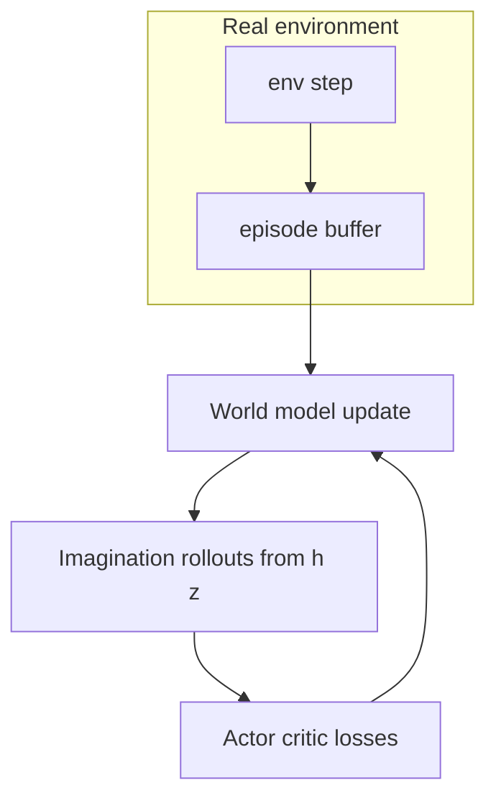

# Dreamer (RSSM world model + imagination actor–critic)

## 1. Overview

**Dreamer**-style agents (Hafner et al., 2019–2024) learn a **latent dynamics model** (often an **RSSM**: recurrent state-space model) and train the policy **inside imagination**—rollouts in latent space without interacting with the real environment at every gradient step. This repository implements a **discrete-action**, **vector-observation** variant in [`dreamer_agent.py`](../../src/rl_experiments/advanced/dreamer/dreamer_agent.py), with components in [`world_model.py`](../../src/rl_experiments/advanced/dreamer/world_model.py), [`rssm.py`](../../src/rl_experiments/advanced/dreamer/rssm.py), and [`actor_critic.py`](../../src/rl_experiments/advanced/dreamer/actor_critic.py).

---

## 2. Problem setting

Let observations be $o_t$, actions $a_t$ (one-hot for discrete), rewards $r_t$. The RSSM maintains a **deterministic** state $h_t$ and **stochastic** latent $z_t$. The world model predicts:

- latent transition $p_\theta(z_{t+1} \mid h_{t+1})$,
- reward $\hat{r}_t$,
- optionally reconstruction of $o_t$ (encoder/decoder).

The policy $\pi_\phi(a|h,z)$ and value $V_\psi(h,z)$ are trained on **imagined** trajectories from the learned dynamics.

---

## 3. Intuition

- Model-based RL can be **sample-efficient** if the model captures relevant structure.
- **Imagination** decouples policy improvement from expensive real-world interaction (conceptually).
- **RSSM** separates deterministic memory $h_t$ from stochastic uncertainty $z_t$, useful for partially observed or noisy dynamics.

---

## 4. Mathematical formulation

### 4.1 World model losses (typical)

Over a sequence chunk, losses include:

- **Reconstruction / observation modeling** (if decoder present): $-\log p_\theta(o_t \mid \text{decode}(h_t,z_t))$,
- **Reward prediction**: $\|\hat{r}_t - r_t\|^2$,
- **Dynamics / KL**: regularize latent $z$ toward prior $p_\theta(z_{t+1}\mid h_{t+1})$ with KL weight (with KL balancing / free-bits in full Dreamer).

The exact combination is implemented in `WorldModel.compute_loss` (see source).

### 4.2 Actor–critic in imagination

From [`actor_critic.py`](../../src/rl_experiments/advanced/dreamer/actor_critic.py) docstring:

- Roll out horizon $H$ steps in latent imagination.
- Compute **$\lambda$-returns** $R_t^\lambda$ with discount $\gamma$ and $\lambda$ (TD-($\lambda$) style).
- **Actor loss:** maximize expected return (negative of mean return).
- **Critic loss:** regression of $V_\psi$ to $\lambda$-returns.
- **Entropy** bonus on policy entropy.
- **Target critic** slow update (EMA) as in DreamerV3-style practice.

---

## 5. Architecture and data flow



**RSSM path (interaction):** encoder embeds $o_t$; GRU updates $h_t$; posterior head predicts $z_t$; actor reads $\text{feat}(h_t,z_t)$.

---

## 6. Implementation map

| Stage | Function / method |
|-------|-------------------|
| Episode collection | `_collect_episode()` |
| World model step | `_update_world_model()` → `wm.compute_loss` |
| Actor–critic step | `_update_actor_critic()` → `actor_critic_loss(...)` |
| Checkpoint | `build_custom_model_path` + `torch.save` |

```python
losses = self.wm.compute_loss(obs=batch["obs"], actions=batch["actions"], rewards=batch["rewards"], dones=batch["dones"], device=self.device)
al, cl, info = actor_critic_loss(world_model=self.wm, actor=self.actor, critic=self.critic, target_critic=self.target_critic, ...)
```

---

## 7. Hyperparameters (`DREAMER_CONFIG`)

Key entries include `embed_dim`, `h_dim`, `z_dim`, `horizon` (imagination steps), `gamma`, `lam`, `wm_lr`, `actor_lr`, `critic_lr`, `chunk_len`, `batch_size`. See [`dreamer_agent.py`](../../src/rl_experiments/advanced/dreamer/dreamer_agent.py) for the full table — **scaled for CartPole-class tasks**, not full image DreamerV3.

---

## 8. Relation to published Dreamer lines

- This code follows the **RSSM + imagination actor–critic** paradigm described in Hafner et al.
- It does **not** claim full parity with DreamerV3 image benchmarks (different encoder, network sizes, and training schedules).

---

## 9. References

1. Hafner, D., et al. (2019). *Dream to Control: Learning Behaviors by Latent Imagination.* ICLR.
2. Hafner, D., et al. (2023). *Mastering Diverse Domains through World Models.* (DreamerV3) — architecture and training details.

---

## Appendix: Pseudocode and formal notes

Notation: [`00_notation_and_conventions.md`](00_notation_and_conventions.md). Model error: [`theoretical_appendix_model_based.md`](theoretical_appendix_model_based.md).

### A. Pseudocode (latent imagination, schematic)

```text
World model: infer latent z_t from obs history; predict z_{t+1}, r_t from (z_t, a_t)
repeat
  Update world model on sequences from env (ELBO / RSSM losses)
  Imagine trajectories in latent space: roll out policy π(a|z) for H steps under model dynamics
  Compute λ-returns along imagined trajectories; update actor to maximize and critic to match
  Interact with env; store real episodes for world-model training
until stopping criterion
```

### B. Assumptions (informal)

**A1 (Markov in latent space).** The RSSM assumes **approximately Markov** latent dynamics so that **imagined** rollouts approximate policy improvement in the real MDP.

**A2 (reconstruction vs control).** Pixel/vector reconstruction and latent prediction trade off **representation** quality vs **planning** utility.

**A3 (imagination horizon).** Longer $H$ increases **compounding error** in latent rollouts; $\lambda$-returns and horizon caps mitigate.

### C. Remarks

- Dreamer-style agents are **sample-efficient** when the world model is accurate in the **tube** visited by improving policies.
- This repository’s configs are **smaller** than image DreamerV3; fidelity caveats apply.
