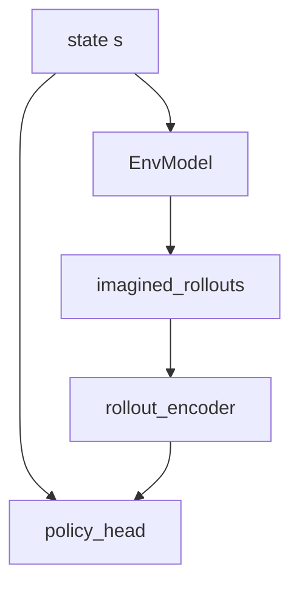

# I2A (Imagination-Augmented Agents)

## 1. Overview

**Imagination-Augmented Agents** (Weber et al., 2017) augment an agent’s decision with **imagined rollouts** from a learned environment model. The policy conditions on both the current observation and **features extracted from imagined trajectories**.

Implementation: [`train_i2a`](../../src/rl_experiments/advanced/i2a/i2a_agent.py) with `EnvModel` and `I2APolicy`.

---

## 2. Problem setting

Let $\hat{T}_\phi$ approximate one-step dynamics. From state $s$, the agent imagines rollouts under a rollout policy; an encoder (e.g. GRU) aggregates imagined outcomes into a vector $c(s)$. The policy outputs $\pi_\theta(a|s, c(s))$.

---

## 3. Intuition

- **Model-free** policies can be myopic; **imagination** injects lookahead structure without explicit tree search.
- The model need not be perfect; features can still help when errors are regularized.

---

## 4. Mathematical formulation (sketch)

- **Model loss:** supervised next-state and reward prediction.
- **Policy loss:** policy gradient or actor-critic loss on **augmented** state $[s, c]$.

---

## 5. Architecture



---

## 6. Code anchor

```python
class I2APolicy(nn.Module):
    self.rollout_encoder = nn.GRU(input_size=obs_dim + 1, hidden_size=hidden, batch_first=True)
    self.policy_head = nn.Sequential(nn.Linear(obs_dim + hidden, hidden), nn.ReLU(), nn.Linear(hidden, n_actions))
```

---

## 7. References

1. Weber, T., et al. (2017). *Imagination-Augmented Agents for Deep Reinforcement Learning.* NeurIPS.

---

## Appendix: Pseudocode and formal notes

Notation: [`00_notation_and_conventions.md`](00_notation_and_conventions.md). Rollouts: [`theoretical_appendix_model_based.md`](theoretical_appendix_model_based.md).

### A. Pseudocode (imagination branch + policy)

```text
Model m_φ predicts next observations (or features) given actions
For each real observation s:
  Imagine K rollouts under rollout policy; encode trajectories with I2A module
  Policy π_θ(a | s, η) conditions on imagination summary η (e.g. GRU over imagined frames)
Update π with policy gradient; update m_φ with supervised / auxiliary losses
```

### B. Assumptions (informal)

**A1 (useful imagination).** Imagined trajectories must be **informative** without dominating real gradients when the model is wrong.

**A2 (computational cost).** Multiple imagined rollouts per state multiply forward passes; $K$ is a **budget** knob.

### C. Remarks

- I2A is an early **explicit** architecture for model-based **features** feeding a policy; later work (Dreamer, MuZero) integrates planning differently.
- Model bias can **steer** the policy toward **hallucinated** optima—regularization and data mixing matter.
