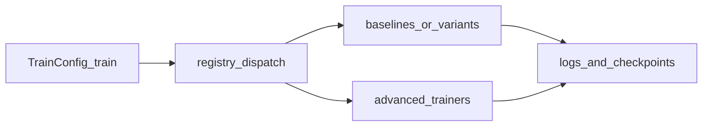

# Algorithm documentation (academic reference)

This section documents **every algorithm registered** in [`register_all()`](../../src/rl_experiments/api/registry.py). Each page is written for **academic readers**: problem setting, intuition, **mathematical objectives**, architecture, and **code anchors** into the implementation.

For a short **fidelity vs paper** checklist (scaled budgets, MLP vs CNN, etc.), see [`algorithm_fidelity.md`](../algorithm_fidelity.md).

**Formal notation** shared across pages: [`00_notation_and_conventions.md`](00_notation_and_conventions.md). **Model-based theory** (compounding error, ensembles): [`theoretical_appendix_model_based.md`](theoretical_appendix_model_based.md).

## Baselines and DQN family

- [PPO](ppo.md) — clipped surrogate, GAE, SB3 implementation
- [SAC](sac.md) — maximum entropy off-policy actor–critic, twin Q
- [DQN](dqn.md) — replay + target network (SB3)
- [Double DQN](double_dqn.md) — decoupled target selection/evaluation
- [PER-DQN](per_dqn.md) — prioritized replay + importance sampling
- [Rainbow DQN](rainbow.md) — combined improvements + C51

## Advanced algorithms

- [Dreamer](dreamer.md) — RSSM world model + imagination actor–critic
- [MuZero](muzero.md) — representation / dynamics / prediction + MCTS
- [PETS](pets.md) — ensemble dynamics + CEM MPC
- [MBPO](mbpo.md) — dynamics model + SAC with synthetic rollouts
- [PlaNet](planet.md) — pixel encoder + RSSM + latent planning
- [TD-MPC](tdmpc.md) — latent planning with value backup
- [TD-MPC2](tdmpc2.md) — variant with longer horizon in this repo
- [World Models](world_models.md) — VAE + recurrent latent + controller
- [I2A](i2a.md) — imagination-augmented policy
- [MVE](mve.md) — model-based value expansion
- [STEVE](steve.md) — uncertainty-weighted value expansion

## End-to-end dispatch

