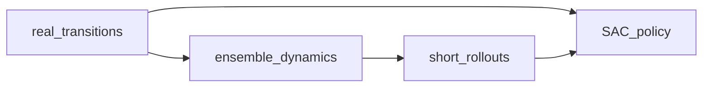

# MBPO (Model-Based Policy Optimization)

## 1. Overview

**MBPO** (Janner et al., 2019) learns a **dynamics model** and uses **short synthetic rollouts** from model-generated data to improve **policy** learning, typically with an off-policy policy-gradient algorithm (here **SAC** from Stable-Baselines3). The key idea is to improve sample efficiency while controlling **model error** by keeping rollouts short.

Implementation: [`train_mbpo`](../../src/rl_experiments/advanced/mbpo/mbpo_agent.py).

---

## 2. Problem setting

Let $\hat{T}_\phi(s'|s,a)$ be a learned dynamics model. MBPO augments real data $\mathcal{D}_{\text{env}}$ with **k-step** model rollouts $\mathcal{D}_{\text{model}}$ to train policy $\pi_\theta$ with:


$$
\mathcal{J}(\theta) = \mathbb{E}_{\mathcal{D}_{\text{env}} \cup \mathcal{D}_{\text{model}}\}}[\text{RL objective}(\theta)].
$$


---

## 3. Intuition

- Pure model-based RL can diverge when the model is wrong; **short horizons** limit compounding error.
- Combining with **off-policy SAC** reuses data efficiently.

---

## 4. Mathematical formulation (conceptual)

- **Dynamics loss:** supervised learning on $(s,a,r,s')$ transitions.
- **Policy loss:** SAC objective on replay that mixes real and model transitions (exact ratio in code).

---

## 5. Architecture



---

## 6. Code anchor

```python
sac = SAC("MlpPolicy", env, device=get_device_str(verbose=False), tensorboard_log="logs/tensorboard/mbpo", seed=seed, verbose=0)
```

Dynamics model is saved separately (`mbpo_dynamics` checkpoint path in registry).

---

## 7. References

1. Janner, M., Fu, J., Zhang, M., & Levine, S. (2019). *When to Trust Your Model: Model-Based Policy Optimization.* NeurIPS.

---

## Appendix: Pseudocode and formal notes

Notation: [`00_notation_and_conventions.md`](00_notation_and_conventions.md). Model error: [`theoretical_appendix_model_based.md`](theoretical_appendix_model_based.md).

### A. Pseudocode (short model rollouts + off-policy RL)

```text
Maintain real buffer D_env; train dynamics model f_φ on (s,a,r,s′)
repeat
  Sample s ~ D_env; rollout k steps under f_φ and current π_θ
  Add synthetic transitions to D_model (cap ratio vs real data per hyperparameters)
  Train SAC (or other off-policy learner) on D_env ∪ D_model
  Collect more real data with π_θ; refresh D_env
until stopping criterion
```

### B. Assumptions (informal)

**A1 (rollout length).** **Small $k$** limits compounding dynamics error; this is central to MBPO’s “when to trust” analysis.

**A2 (policy class).** SAC’s stability properties hold on **mixed** data only approximately; model data shifts the effective MDP.

**A3 (ensemble).** When used, ensembles approximate **uncertainty**; mixing rates may depend on disagreement (implementation-dependent).

### C. Remarks

- MBPO is **not** pure model-based: the **real** buffer anchors value estimates against model drift.
- See the paper for **monotonic improvement**-style statements under explicit assumptions on model error.
