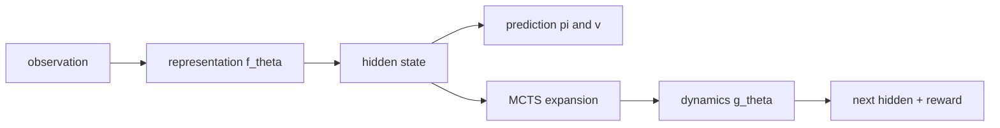

# MuZero

## 1. Overview

**MuZero** (Schrittwieser et al., 2020) learns a model that maps observations to a **hidden state** and predicts **policy**, **value**, and **reward** without requiring a full simulator of the environment dynamics in raw observation space. Planning is performed via **Monte Carlo Tree Search (MCTS)** with **PUCT**-style selection on the learned model.

Implementation: [`MuZeroAgent`](../../src/rl_experiments/advanced/muzero/muzero_agent.py), [`networks.py`](../../src/rl_experiments/advanced/muzero/networks.py), [`mcts.py`](../../src/rl_experiments/advanced/muzero/mcts.py), [`replay_buffer.py`](../../src/rl_experiments/advanced/muzero/replay_buffer.py).

---

## 2. Problem setting

At each real step $t$:

1. **Representation $f_\theta(s)$:** maps observation $o_t$ to hidden state $h_t$.
2. **Dynamics $g_\theta(h,a)$:** predicts next hidden state and immediate reward.
3. **Prediction $p_\theta(h)$:** outputs policy logits $\pi$ and scalar value $v$.

MCTS uses these networks to simulate future trajectories in **hidden space**.

---

## 3. Intuition

- Unlike model-based planning with known physics, MuZero learns what is **predictable and useful for planning** (value, policy, reward) even when observation reconstruction is hard.
- MCTS **bootstraps** policy improvement by combining learned priors with lookahead search.

---

## 4. Mathematical formulation

### 4.1 MCTS (PUCT-style)

At node $s$, child $a$ is selected via upper confidence:


$$
U(s,a) = Q(s,a) + c_{\text{puct}} \cdot P(s,a) \frac{\sqrt{N(s)}}{1+N(s,a)},
$$


with $P$ from the prediction network, $Q$ from visit statistics, and $N$ visit counts (implementation details in `MCTS`).

### 4.2 Training loss (unrolled $K$ steps)

Typical MuZero training minimizes a sum of:

- **Policy loss:** cross-entropy between predicted policy and MCTS-improved policy $\pi_{\text{mcts}}$.
- **Value loss:** MSE between predicted value and $n$-step return bootstrap.
- **Reward loss:** MSE between predicted reward and environment reward.

See `MuZeroAgent` training step for exact tensors and unroll length `K`.

---

## 5. Architecture diagram



---

## 6. Implementation map

| Component | Role |
|-----------|------|
| `RepresentationNetwork` | $o \to h$ |
| `DynamicsNetwork` | $(h, a) \to (h', r)$ |
| `PredictionNetwork` | $h \to (\pi, v)$ |
| `MCTS.improved_policy` | Returns MCTS policy and executed action |
| `MuZeroReplayBuffer` | Stores self-play trajectories |

```python
h_t = self.repr_net(obs_t)
policy_target, action_idx = self.mcts.improved_policy(h_t, temperature=temp)
```

---

## 7. Hyperparameters (`MUZERO_CONFIG`)

Notable keys: `hidden_dim`, `n_simulations`, `c_init`, `c_base` (PUCT), `K` unroll steps, `gamma`, `lr`, `batch_size`. Values are **reduced** for small environments compared to large-scale Atari/Go in the Nature paper.

---

## 8. Limitations

- Full-scale MuZero uses **schedules**, **reanalyses**, and **larger networks**; this repo is a **teaching-scale** implementation.
- Performance on discrete vector tasks is for **demonstration**, not leaderboard reproduction.

---

## 9. References

1. Schrittwieser, J., et al. (2020). *Mastering Atari, Go, Chess and Shogi by Planning with a Learned Model.* Nature 588, 604–609.
2. Silver, D., et al. (2017). *Mastering the game of Go without human knowledge* — background on MCTS + learned priors.

---

## Appendix: Pseudocode and formal notes

Notation: [`00_notation_and_conventions.md`](00_notation_and_conventions.md).

### A. Pseudocode (representation + MCTS loop, schematic)

```text
Networks: representation h_θ(s), dynamics g_θ(s,a), prediction f_θ(s) → policy, value
repeat
  Root s; build latent s_0 = h_θ(s)
  MCTS: simulate K-step unrolls with PUCT using π, V from f_θ, transitions from g_θ
  Select action from visit-count policy at root; env step
  Store trajectory; train θ by matching policy targets (MCTS visit dist) and value/reward targets
until stopping criterion
```

### B. Assumptions (informal)

**A1 (consistency).** **Same** latent must support accurate **dynamics**, **policy**, and **value** predictions along imagined trajectories (multi-head consistency).

**A2 (planning signal).** MCTS improves **policy targets** beyond one-step Bellman errors; sample complexity trades off with `n_simulations`.

**A3 (scale).** Small `n_simulations` and networks may **not** replicate paper-level planning strength.

### C. Remarks

- MuZero **does not** require an explicit environment model in the sense of known physics; it learns a **model sufficient for planning**.
- Discrete action spaces align naturally with visit-count policies; continuous extensions exist but differ.
