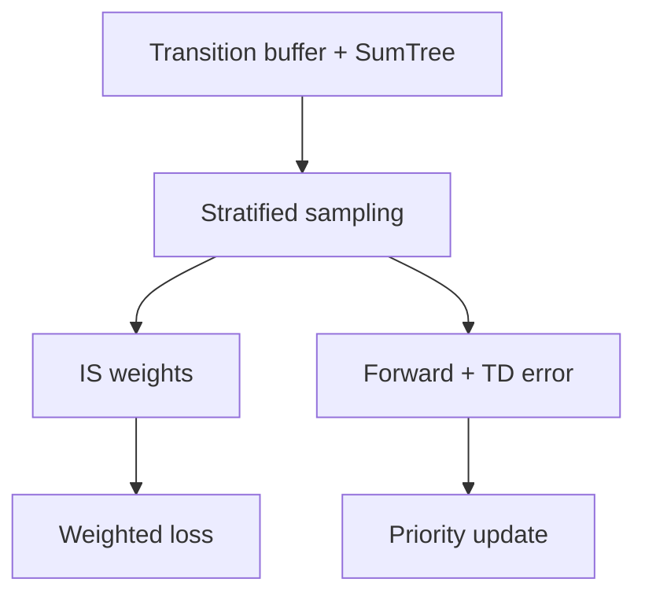

# Prioritized Experience Replay DQN (PER-DQN)

## 1. Overview

**Prioritized Experience Replay** (Schaul et al., 2015) samples transitions with probability proportional to their **TD error magnitude**, so “surprising” transitions are learned from more often. To correct for the induced bias, **importance-sampling weights** are applied, with exponent $\beta$ annealed toward 1.

Implementation: [`train_dqn_variant(..., "per_dqn")`](../../src/rl_experiments/baselines/dqn_variants.py).

---

## 2. Problem setting

Uniform replay samples $i \sim \text{Uniform}(\{1,\ldots,N\})$. PER instead uses:


$$
P(i) \propto \big(|\delta_i| + \epsilon\big)^\alpha,
$$


where $\delta_i$ is the last TD error for transition $i$, $\alpha \in [0,1]$ trades off between uniform ($\alpha=0$) and fully prioritized ($\alpha=1$), and $\epsilon$ avoids zero priority.

---

## 3. Intuition

- Transitions with large TD error indicate **large prediction mistakes**; revisiting them speeds learning.
- Without correction, prioritized sampling is biased; **IS weights** $w_i \propto (N P(i))^{-\beta}$ yield unbiased gradient estimates in expectation as $\beta \to 1$.

---

## 4. Mathematical formulation

For a minibatch indexed by $i$:

1. Sample index $i$ with probability $p_i = P(i) / \sum_j P(j)$.
2. Compute weight $w_i = (N \cdot p_i)^{-\beta} / \max_k w_k$ (normalized as in proportional PER implementations).
3. Weighted loss:


$$
L = \mathbb{E}_i\big[ w_i \cdot \ell(Q_\theta(s_i,a_i), y_i) \big],
$$


with $\ell$ smooth L1 here.

4. Update priorities: $p_i \leftarrow (|\delta_i| + \epsilon)^\alpha$.

---

## 5. Architecture



**Sum-tree** implementation: `SumTree` and `PrioritizedReplayBuffer` in [`dqn_variants.py`](../../src/rl_experiments/baselines/dqn_variants.py) enable $O(\log N)$ sampling and updates.

---

## 6. Code anchor

```python
weights = (self.size * probs) ** (-beta)
weights /= weights.max()
# ...
replay.update_priorities(idxs, td_err, cfg.per_eps)
```

---

## 7. Hyperparameters (VariantConfig)

| Parameter | Default | Role |
|-----------|---------|------|
| `per_alpha` $\alpha$ | 0.6 | Priority exponent |
| `per_beta_start` | 0.4 | Initial IS exponent |
| `per_beta_frames` | 200000 | Anneal horizon for $\beta \to 1$ |
| `per_eps` $\epsilon$ | $10^{-5}$ | Numerical floor on priorities |

---

## 8. References

1. Schaul, T., Quan, J., Antonoglou, I., & Silver, D. (2015). *Prioritized Experience Replay.* ICLR.
2. See also: segment-tree and proportional prioritization discussion in the paper’s appendix.

---

## Appendix: Pseudocode and formal notes

Notation: [`00_notation_and_conventions.md`](00_notation_and_conventions.md).

### A. Pseudocode (prioritized replay + IS correction)

```text
Maintain replay with priority p_i for transition i (e.g. TD-error proxy)
Sample minibatch with P(i) ∝ p_i^α
Compute TD target y_i and loss gradient as for DQN
Importance weight w_i = ( N · P(i) )^{−β}  (normalized); multiply gradient by w_i
Update priorities p_i ← |TD-error_i| + ε
Anneal β → 1 over training (paper schedule)
```

### B. Assumptions (informal)

**A1 (unbiased limit).** When $\beta=1$ and priorities match true sampling probabilities, weighted updates target the **same** expected gradient as uniform replay under ideal conditions.

**A2 (bias during annealing).** Early training uses $\beta<1$: updates are **biased** toward high-priority transitions by design (emphasis on “surprising” events).

**A3 (priority noise).** TD-error priorities are **proxy** for surprise; they correlate with but do not equal optimal replay distribution.

### C. Remarks

- Segment trees / sum trees implement **O(log N)** sampling for large buffers.
- Combined with **n-step** or **distributional** heads, priorities should be computed on the **same** TD definition used for learning.
