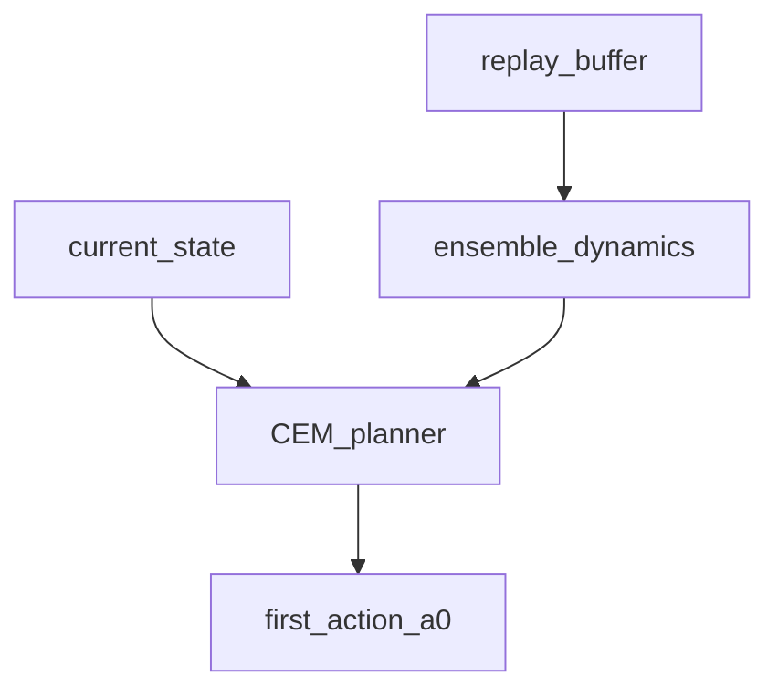

# PETS (Probabilistic Ensembles with Trajectory Sampling)

## 1. Overview

**PETS** (Chua et al., 2018) combines **probabilistic ensemble dynamics** with **sample-based trajectory planning** (MPC). At each decision step, the agent samples candidate action sequences, rolls them forward through the learned dynamics model, and selects the first action of the best sequence.

Implementation: [`train_pets`](../../src/rl_experiments/advanced/pets/pets_agent.py) using `EnsembleDynamics` and [`cem_plan`](../../src/rl_experiments/advanced/common/planning.py) with [`cem_score_ensemble_dynamics`](../../src/rl_experiments/advanced/training/cem_score.py).

---

## 2. Problem setting

Let $f_\theta(s,a)$ approximate the next state (or delta). An ensemble $\{f_{\theta^{(k)}}\}_{k=1}^K$ models **epistemic uncertainty**. Planning maximizes:


$$
\max_{a_{0:H-1}} \mathbb{E}\Big[\sum_{t=0}^{H-1} \gamma^t r(s_t, a_t) \big| s_0 = s\Big],
$$


where expectation is approximated by **particle rollouts** through ensemble members.

---

## 3. Intuition

- Single deterministic models overfit and plan optimistically; **ensembles** expose disagreement.
- **CEM** (Cross-Entropy Method) refines a distribution over action sequences instead of exhaustive search.

---

## 4. Mathematical formulation

### 4.1 Ensemble dynamics loss

Each member predicts $(\Delta s, r)$ or next state; training minimizes MSE to targets (see `pets_agent` forward).

### 4.2 CEM planning

CEM maintains a Gaussian over action sequences; iteratively samples candidates, evaluates scores, and refits to elite samples.

---

## 5. Architecture



---

## 6. Code anchor

```python
def score_fn(action_seq):
    return cem_score_ensemble_dynamics(model, obs_np, obs_dim, device, action_seq, 0.99, value_fn=None)
a0 = cem_plan(score_fn, horizon=15, action_dim=action_dim, n_samples=64, n_iters=3)
```

---

## 7. Hyperparameters (typical in file)

- Ensemble size 5, horizon 15, CEM samples 64, iterations 3 — **smaller** than full paper runs on MuJoCo.

---

## 8. References

1. Chua, K., Calandra, R., McAllister, R., & Levine, S. (2018). *Deep Reinforcement Learning in a Handful of Trials using Probabilistic Dynamics Models.* NeurIPS.

---

## Appendix: Pseudocode and formal notes

Notation: [`00_notation_and_conventions.md`](00_notation_and_conventions.md). Compounding error and ensembles: [`theoretical_appendix_model_based.md`](theoretical_appendix_model_based.md).

### A. Pseudocode (ensemble dynamics + CEM MPC)

```text
Train ensemble {f^(i)_φ} to predict s_{t+1} given (s_t, a_t) with heteroscedastic or probabilistic heads
At each decision time:
  CEM: sample action sequences; simulate each sequence through ensemble (e.g. sample member per step or mean)
  Score trajectories by discounted return (and optional terminal value)
  Refit Gaussian over action sequences from elite samples; repeat for few iterations
  Execute first action; observe true transition; add data; retrain periodically
```

### B. Assumptions (informal)

**A1 (probabilistic model).** Ensemble or BNN captures **epistemic** uncertainty; PETS uses it to avoid **overconfident** exploitation of wrong dynamics.

**A2 (planning horizon).** Short horizons + **receding horizon** control limit error from long model rollouts.

**A3 (smoothness).** CEM works best when **near-optimal** action sequences cluster so Gaussian elites are meaningful.

### C. Remarks

- PETS is **not** policy-gradient RL; it is **model predictive control** with learned dynamics.
- Sample efficiency depends on **model quality** in the region explored by CEM.
