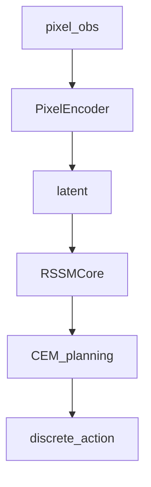

# PlaNet (Deep Planning Network)

## 1. Overview

**PlaNet** (Hafner et al., 2019) learns a **latent dynamics model** from pixels and **plans** actions by optimizing in **latent space** (e.g. MPC / CEM). This repository provides a **compact** pixel-based pipeline in [`train_planet`](../../src/rl_experiments/advanced/planet/planet_agent.py) with `PixelEncoder`, `RSSMCore`, and latent CEM planning.

---

## 2. Problem setting

Observations $o_t$ are high-dimensional (e.g. stacked frames). An encoder $e_\psi(o)$ maps to latent $z_t$. A recurrent model predicts transitions in latent space. Planning chooses actions to maximize predicted return along imagined trajectories.

---

## 3. Intuition

- Planning in latent space is cheaper than planning in raw pixels.
- RSSM-like cores capture **partial observability** and uncertainty.

---

## 4. Mathematical formulation

Training combines **reconstruction / latent prediction** losses (see `train_planet` inner loop) with **planning reward** proxies via decoder head on latent.

---

## 5. Architecture



---

## 6. Implementation map

- `make_pixel_env`, `obs_to_chw` for tensor layout
- `rssm.step` for latent transitions
- `cem_plan` over discrete action approximations

### Code anchor

```python
h, _, _, qm, _ = rssm.step(h, z, one_hot, emb=z)
z = qm
```

---

## 7. References

1. Hafner, D., et al. (2019). *Learning Latent Dynamics for Planning from Pixels.* ICML.

---

## Appendix: Pseudocode and formal notes

Notation: [`00_notation_and_conventions.md`](00_notation_and_conventions.md). Latent rollouts: [`theoretical_appendix_model_based.md`](theoretical_appendix_model_based.md).

### A. Pseudocode (RSSM + latent CEM, schematic)

```text
Encoder: e(o_t) → embed; RSSM infers stochastic z_t and deterministic h_t
Dynamics: (h_t, z_t, a_t) → (h_{t+1}, z_{t+1}); reward head predicts r_t
Planning: CEM in action space using imagined latent trajectories; score by return
Execute first action; train model on observed sequences (ELBO + reward)
```

### B. Assumptions (informal)

**A1 (partial observability).** RSSM targets **belief states** where planning is Markov **approximately**.

**A2 (pixel vs vector).** This repo may use **vector** observations; the original paper emphasizes **pixels** — fidelity differs.

**A3 (planning cost).** CEM scales with horizon and action dimension; discretization of actions is a **coarse** approximation.

### C. Remarks

- PlaNet predates Dreamer’s actor–critic imagination; emphasis is **latent MPC** rather than policy gradients in imagination.
- Compounding error still applies in **latent** space; calibration depends on encoder quality.
