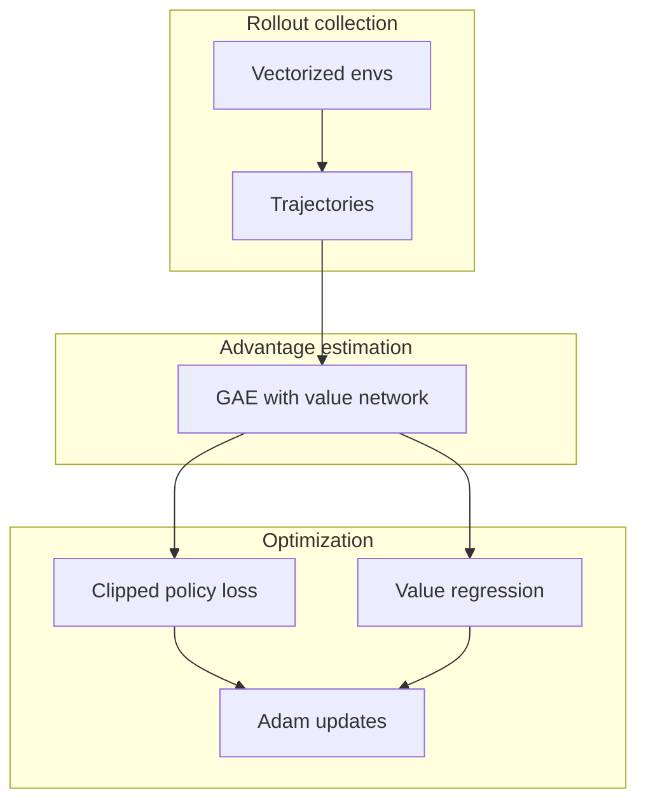

# Proximal Policy Optimization (PPO)

## 1. Overview

**Proximal Policy Optimization** (Schulman et al., 2017) is an on-policy actor–critic method that stabilizes policy-gradient learning by **clipping** the probability ratio between the new and old policy. Training alternates between collecting rollouts and performing several epochs of minibatch updates on that fixed batch, which makes PPO sample-efficient relative to vanilla REINFORCE and more stable than TRPO for many practical settings.

In this repository, PPO is provided via **Stable-Baselines3** (`PPO`), configured in [`ppo_experiment.py`](../../src/rl_experiments/baselines/ppo_experiment.py).

---

## 2. Problem setting

Consider a Markov decision process $(\mathcal{S}, \mathcal{A}, P, r, \gamma)$. A stochastic policy $\pi_\theta(a|s)$ defines the distribution over actions. The **state-value** under $\pi_\theta$ is


$$
V^{\pi_\theta}(s) = \mathbb{E}_{\pi_\theta}\Big[\sum_{t=0}^{\infty} \gamma^t r_t \,\Big|\, s_0 = s\Big].
$$


Policy-gradient methods maximize $J(\theta) = \mathbb{E}_{s \sim \rho^{\pi_\theta}}[V^{\pi_\theta}(s)]$ using gradients of a surrogate objective built from **advantages** $A_t$.

---

## 3. Intuition

- **Large policy updates** in vanilla policy gradients can collapse performance when the new policy assigns very different probabilities to past actions.
- PPO constrains each update so that $\pi_\theta(a_t|s_t)$ does not move too far from $\pi_{\theta_{\text{old}}}(a_t|s_t)$, using a **clipped** surrogate that removes incentive for extreme ratio values.
- **GAE** (Generalized Advantage Estimation) trades bias and variance in advantage estimates using a parameter $\lambda$.

---

## 4. Mathematical formulation

### 4.1 Probability ratio

After collecting a trajectory, define the ratio


$$
r_t(\theta) = \frac{\pi_\theta(a_t|s_t)}{\pi_{\theta_{\text{old}}}(a_t|s_t)}.
$$


### 4.2 Clipped surrogate objective

The **clipped PPO objective** for the policy is


$$
L^{\text{CLIP}}(\theta) = \mathbb{E}_t\Big[\min\big(r_t(\theta)\hat{A}_t,\; \text{clip}(r_t(\theta), 1-\epsilon, 1+\epsilon)\hat{A}_t\big)\Big],
$$


where $\hat{A}_t$ is an advantage estimate and $\epsilon$ is the clip range (commonly $0.2$).

The full loss typically adds a **value-function** term and an **entropy** bonus:


$$
L(\theta) = -L^{\text{CLIP}}(\theta) + c_1 \, L^{VF}(\theta) - c_2 \, H[\pi_\theta](\cdot|s_t),
$$


with $L^{VF}$ the mean squared error between predicted value and return target, $c_1$ value coefficient, $c_2$ entropy coefficient.

### 4.3 GAE advantages

Advantages are often computed with **GAE-$\lambda$**:


$$
\hat{A}_t = \sum_{l=0}^{T-t-1} (\gamma\lambda)^l\, \delta_{t+l}, \quad
\delta_t = r_t + \gamma V(s_{t+1}) - V(s_t).
$$


---

## 5. Architecture and data flow



**Policy and value networks:** SB3 `MlpPolicy` uses shared or separate MLP heads; this repo sets `net_arch: [64, 64]` with **tanh** activations in `PPO_CONFIG`.

---

## 6. Implementation in this repository

| Component | Location |
|-----------|----------|
| Training entry | `run_ppo()` in [`ppo_experiment.py`](../../src/rl_experiments/baselines/ppo_experiment.py) |
| Hyperparameters | `PPO_CONFIG` (same file) |
| Registry dispatch | `_train_ppo()` in [`registry.py`](../../src/rl_experiments/api/registry.py) |
| Backend | `stable_baselines3.PPO` |

Vectorized environments (`make_vec_env`, `n_envs=4` except Pendulum) feed rollouts into SB3’s PPO update.

```python
model = PPO(
    policy="MlpPolicy",
    env=vec_env,
    device=device,
    seed=seed,
    tensorboard_log="logs/tensorboard/ppo",
    **PPO_CONFIG,
)
model.learn(total_timesteps=total_timesteps, callback=cb, progress_bar=True)
```

---

## 7. Hyperparameters (this repo)

| Symbol / key | Value | Role |
|--------------|-------|------|
| `learning_rate` | $3\times 10^{-4}$ | Adam step size |
| `n_steps` | 2048 | Steps per env per rollout |
| `batch_size` | 64 | Minibatch size |
| `n_epochs` | 10 | SGD epochs per rollout |
| `gamma` | 0.99 | Discount |
| `gae_lambda` | 0.95 | GAE $\lambda$ |
| `clip_range` $\epsilon$ | 0.2 | Trust region via clipping |
| `vf_coef` $c_1$ | 0.5 | Value loss weight |
| `ent_coef` $c_2$ | 0.0 | Entropy bonus (zero for these toy runs) |
| `net_arch` | [64, 64] | Hidden layers |

---

## 8. Relation to the paper and limitations

- The **clipped objective** and **multi-epoch** updates follow the standard PPO recipe; exact coefficients match common OpenAI/SB3 defaults for MLP policies.
- Full-scale experiments in the paper often use different entropy schedules and network sizes; **entropy is disabled** here (`ent_coef=0`) for discrete classic control—a valid choice but not universal.
- Theoretical monotonic improvement guarantees of TRPO are **not** exactly inherited; PPO is a practical approximation.

---

## 9. References

1. Schulman, J., Wolski, F., Dhariwal, P., Radford, A., & Klimov, O. (2017). *Proximal Policy Optimization Algorithms.* arXiv:1707.06347.
2. Stable-Baselines3 documentation: [PPO](https://stable-baselines3.readthedocs.io/en/master/modules/ppo.html).

---

## Appendix: Pseudocode and formal notes

Shared notation: [`00_notation_and_conventions.md`](00_notation_and_conventions.md).

### A. Pseudocode (on-policy with clipping)

```text
Algorithm: PPO (actor–critic with clipped surrogate)
Input: policy π_φ, value V_ψ, env, horizon T, epochs K, minibatch size B, clip ε, coef c1, c2
repeat
  Collect trajectories {s_t,a_t,r_t} under π_φ for T steps per worker
  Compute advantages A_t (e.g. GAE with λ) and returns R_t
  for epoch = 1 to K do
    Shuffle data; for each minibatch B:
      L_clip(φ) = E[ min(r_t(φ) A_t, clip(r_t(φ), 1−ε, 1+ε) A_t) ],  r_t = π_φ(a_t|s_t) / π_old(a_t|s_t)
      L_vf = E[ (V_ψ(s_t) − R_t)^2 ]
      L = −L_clip + c1 L_vf − c2 H[π_φ]
      Update φ, ψ by gradient descent on L (SB3: minimize combined surrogate + value + entropy penalty)
until stopping criterion
```

### B. Assumptions (informal)

**A1 (policy class).** $\pi_\phi$ is differentiable a.e. and **clipped ratios** remain bounded on collected data.

**A2 (stationarity).** Rollouts are long enough that empirical **advantage** estimates have finite variance under the behavior policy.

**A3 (optimization).** Multiple epochs on the **same** batch introduce off-policy error; PPO mitigates via clipping, not by restoring exact on-policy trust regions.

### C. Remarks

- **Monotonic improvement** holds for exact trust-region methods; PPO’s clip is a **practical surrogate** without the same certificate.
- **GAE bias–variance** is controlled by $\lambda$; $\lambda=1$ reduces bias in the advantage target at the cost of variance.
