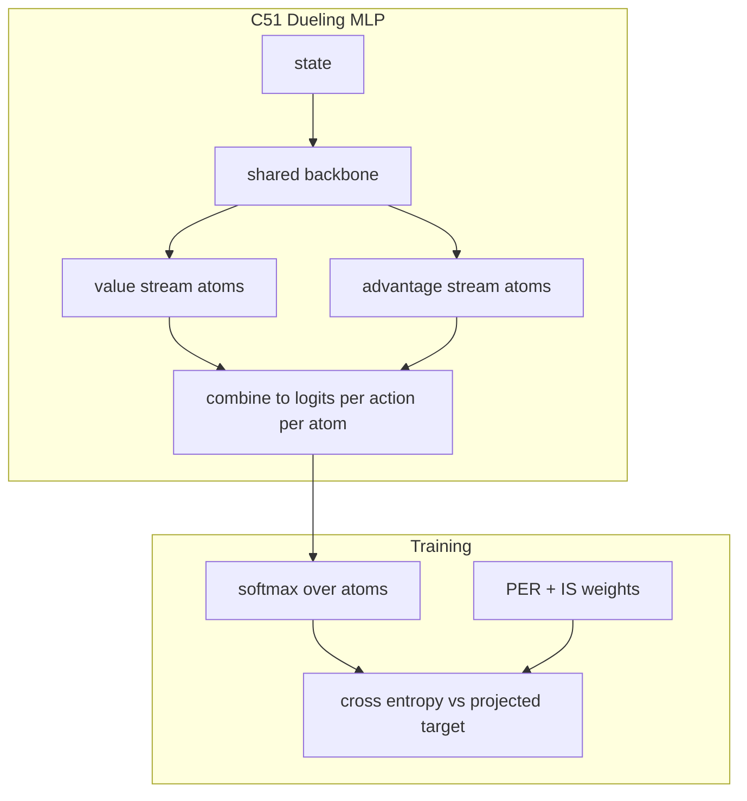

# Rainbow DQN

## 1. Overview

**Rainbow** (Hessel et al., 2018) combines six independent improvements to DQN into one agent: **Double Q-learning**, **prioritized replay**, **dueling networks**, **multi-step returns**, **distributional RL (C51)**, and **Noisy Nets** for exploration. This repository implements the combined stack in [`dqn_variants.py`](../../src/rl_experiments/baselines/dqn_variants.py) with **MLP** backbones for vector states (not Atari CNNs).

---

## 2. Intuition

- **Double** reduces overestimation in the distributional bootstrap.
- **PER** focuses learning on high-TD-error transitions.
- **Dueling** separates state value $V(s)$ and action advantages $A(s,a)$ for better generalization.
- **n-step** returns propagate rewards faster along trajectories.
- **Noisy Nets** replace $\epsilon$-greedy with learned parametric noise in linear layers.
- **C51** models a distribution over returns (atoms) instead of a scalar $Q$.

---

## 3. Mathematical formulation

### 3.1 Dueling structure (distributional)

For each action $a$, logits over $N_{\text{atoms}}$ atoms per $(s,a)$; combine value stream $V(s)$ and advantage stream $A(s,a)$:


$$
Z_\theta(s,a) = V_\theta(s) + A_\theta(s,a) - \frac{1}{|\mathcal{A}|}\sum_{a'} A_\theta(s,a'),
$$


then softmax over atoms yields categorical probabilities $p_\theta(z|s,a)$ on fixed support $\{z_i\}_{i=1}^{N}$.

### 3.2 Bellman update for distributions (projection)

Target distribution is built from the **projected** Bellman operator onto the atom grid (C51; Bellemare et al., 2017). The loss is **cross-entropy** between predicted logits and projected target distribution.

### 3.3 Double DQN in distributional form

Action selection for the next state uses **online** network mean Q (or argmax over expected Q from categorical):


$$
a^* = \arg\max_{a'} \mathbb{E}_{Z \sim p_\theta}[Z(s',a')],
$$


then evaluate **target** distribution at $(s', a^*)$.

### 3.4 n-step

Return uses $n=3$ in Rainbow mode:


$$
R^{(n)}_t = \sum_{k=0}^{n-1} \gamma^k r_{t+k}.
$$


---

## 4. Architecture diagram



**Noisy layers:** `NoisyLinear` uses factorized Gaussian noise (Fortunato et al., 2017).

---

## 5. Implementation map

| Piece | Code |
|-------|------|
| Variant dispatch | `train_dqn_variant(..., "rainbow")` |
| Rainbow flags | `use_c51`, `use_noisy`, `dueling`, `n_step=3`, lr/batch override |
| Networks | `C51Network`, `NoisyLinear` in [`dqn_variants.py`](../../src/rl_experiments/baselines/dqn_variants.py) |

```python
if is_rainbow:
    cfg.lr = 6.25e-5
    cfg.batch_size = 32
    cfg.hidden_dim = 256
```

---

## 6. Hyperparameters (Rainbow branch)

| Setting | Value | Reference scale |
|---------|-------|-----------------|
| Learning rate | $6.25 \times 10^{-5}$ | Rainbow paper order of magnitude |
| Batch size | 32 | As in Rainbow for Atari (adapted) |
| n-step | 3 | Multi-step component |
| Atoms | 51 | C51 default |
| Support | [-200, 200] | Task-dependent in full benchmarks; fixed here |

---

## 7. Scope and limitations

- Does **not** include full Atari preprocessing (frame stack, sticky actions, etc.).
- Retrace and some Rainbow ablation variants from the paper are **not** included unless added separately.

---

## 8. References

1. Hessel, M., et al. (2018). *Rainbow: Combining Improvements in Deep Reinforcement Learning.* AAAI.
2. Bellemare, M. G., Dabney, W., & Munos, R. (2017). *A Distributional Perspective on Reinforcement Learning.* ICML (C51).
3. Fortunato, M., et al. (2017). *Noisy Networks for Exploration.* ICLR.

---

## Appendix: Pseudocode and formal notes

Notation: [`00_notation_and_conventions.md`](00_notation_and_conventions.md).

### A. Pseudocode (combined stack, schematic)

```text
Initialize distributional Q(s,a) as categorical over atoms z_j with logits θ
repeat
  Select actions via noisy linear layers (parametric exploration)
  Store transitions; PER samples minibatch with IS weights
  Compute n-step distributional targets (projection onto support)
  Optionally: use Double Q / target network for next action selection
  Minimize cross-entropy between predicted and projected target distribution
  Update priorities from TD error (sum over atoms or KL proxy per implementation)
until stopping criterion
```

### B. Assumptions (informal)

**A1 (factorization).** Rainbow assumes **independent utility** of components (PER, n-step, C51, NoisyNets, etc.); interactions can help or hurt versus single ablations.

**A2 (projection).** C51’s **projection** of the Bellman target onto the fixed support introduces **approximation** unrelated to neural net error.

**A3 (hyperparameters).** Atom count, $V_{\max}$, and n-step length are **task-dependent**; defaults from Atari do not transfer universally.

### C. Remarks

- **Retrace** in full Rainbow is omitted in many compact codebases; check this repo’s fidelity notes.
- Distributional RL improves **risk-sensitive** behavior in some domains via return distribution, not only the mean.
