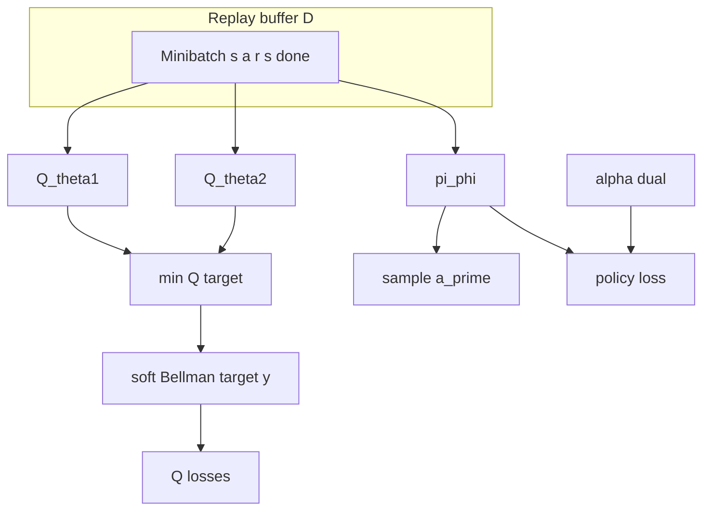

# Soft Actor-Critic (SAC)

## 1. Overview

**Soft Actor-Critic** (Haarnoja et al., 2018) is an off-policy actor–critic algorithm for **continuous** action spaces. It maximizes expected return while also maximizing policy entropy, yielding robust exploration and improved optimization landscapes. SAC uses **twin Q-networks** to mitigate overestimation bias and **Polyak-averaged** target networks for stable bootstrapping.

This repository uses **Stable-Baselines3** `SAC` via [`sac_experiment.py`](../../src/rl_experiments/baselines/sac_experiment.py).

---

## 2. Problem setting

Let $\pi_\phi(a|s)$ be a stochastic policy and $Q_{\theta_i}(s,a)$ critic networks. SAC optimizes a **maximum-entropy** objective:


$$
J(\phi) = \mathbb{E}_{\rho_\pi}\Big[\sum_t \gamma^t \big(r(s_t,a_t) + \alpha \mathcal{H}(\pi_\phi(\cdot|s_t))\big)\Big],
$$


where $\mathcal{H}$ is entropy and $\alpha > 0$ weights the entropy term (often **learned** automatically in SAC v2).

---

## 3. Intuition

- Standard actor–critic methods can collapse to deterministic policies too early; **entropy regularization** keeps the policy stochastic longer, improving exploration.
- **Twin Q-networks**: use $\min(Q_{\theta_1}, Q_{\theta_2})$ in the Bellman target to reduce optimistic bias in Q-learning.
- **Off-policy** learning from a replay buffer improves sample efficiency vs on-policy methods.

---

## 4. Mathematical formulation

### 4.1 Soft Bellman backup

For a given transition $(s,a,r,s')$, define target:


$$
y = r + \gamma \Big( \min_{i=1,2} Q_{\bar{\theta}_i}(s', \tilde{a}') - \alpha \log \pi_\phi(\tilde{a}'|s') \Big), \quad \tilde{a}' \sim \pi_\phi(\cdot|s'),
$$


where $\bar{\theta}_i$ are **target** parameters updated slowly toward $\theta_i$.

### 4.2 Q-loss


$$
L_Q(\theta_i) = \mathbb{E}\big[(Q_{\theta_i}(s,a) - y)^2\big].
$$


### 4.3 Policy and temperature (automatic $\alpha$)

The policy is trained to minimize expected **KL** toward an implicit optimal soft policy; in practice SB3 implements the reparameterized gradient for Gaussian policies. With **automatic entropy tuning**, $\alpha$ is adjusted so that entropy tracks a target $\bar{\mathcal{H}}$ (often $-\dim(\mathcal{A})$ for squashed Gaussian).

---

## 5. Architecture



**Networks:** `policy_kwargs` set **MLP** $[256, 256]$ with **ReLU**, matching the scale of Haarnoja et al. (2018) Table 1 for continuous control.

---

## 6. Implementation in this repository

| Item | Location |
|------|----------|
| Runner | `run_sac()` in [`sac_experiment.py`](../../src/rl_experiments/baselines/sac_experiment.py) |
| Config | `SAC_CONFIG` |
| Safety | Asserts `Box` action space (SAC not valid for `Discrete`) |
| Dispatch | `_train_sac()` in [`registry.py`](../../src/rl_experiments/api/registry.py) |

```python
model = SAC(
    policy="MlpPolicy",
    env=env_id,
    device=device,
    seed=seed,
    tensorboard_log="logs/tensorboard/sac",
    **SAC_CONFIG,
)
```

---

## 7. Hyperparameters (this repo)

| Key | Value | Notes |
|-----|-------|--------|
| `learning_rate` | $3\times 10^{-4}$ | Shared across networks |
| `buffer_size` | $10^6$ | Replay capacity |
| `batch_size` | 256 | Minibatch |
| `tau` | 0.005 | Polyak averaging for targets |
| `gamma` | 0.99 | Discount |
| `ent_coef` | `"auto"` | Automatic $\alpha$ |
| `net_arch` | [256, 256] | ReLU MLP |

---

## 8. Limitations and scope

- Requires **continuous** actions; discrete tasks (e.g. CartPole) should use DQN-family methods instead.
- Performance depends on reward scaling and exploration noise in the environment; SAC is sensitive to poorly scaled rewards in some domains.

---

## 9. References

1. Haarnoja, T., Zhou, A., Abbeel, P., & Levine, S. (2018). *Soft Actor-Critic: Off-Policy Maximum Entropy Deep Reinforcement Learning with a Stochastic Actor.* ICML.
2. Haarnoja, T., et al. (2018). *Soft Actor-Critic Algorithms and Applications.* arXiv:1812.05905.
3. Stable-Baselines3: [SAC](https://stable-baselines3.readthedocs.io/en/master/modules/sac.html).

---

## Appendix: Pseudocode and formal notes

Notation: [`00_notation_and_conventions.md`](00_notation_and_conventions.md).

### A. Pseudocode (maximum-entropy actor–critic)

```text
Algorithm: SAC (twin Q, entropy temperature)
Initialize Q_θ1, Q_θ2, π_φ, target Q̄, optional log α
repeat
  Collect (s,a,r,s′) into replay; sample minibatch
  y = r + γ ( min_i Q̄_θi(s′, ã) − α log π_φ(ã|s′) ),  ã ~ π_φ(·|s′)
  θ ← arg min E[(Q_θi(s,a) − y)^2]  for i ∈ {1,2}
  φ ← arg max E[ min_i Q_θi(s,ã) − α log π_φ(ã|s) ],  ã ~ π_φ(·|s)
  Optionally update α to match target entropy H̄
  Polyak-average Q̄ toward Q
until stopping criterion
```

### B. Assumptions (informal)

**A1 (boundedness).** Rewards and Q targets are numerically stable (often implicit via reward scaling).

**A2 (coverage).** Replay contains **enough** exploratory data so that Bellman backups for $\min_i Q_{\theta_i}$ are meaningful (off-policy correction is implicit in SAC’s formulation, not full IS over long horizons).

**A3 (twin Q).** Two critics reduce **overestimation**; min is a pessimistic target w.r.t. function approximation error.

### C. Remarks

- Automatic entropy $\alpha$ trades **exploration** vs exploitation; wrong target entropy can slow learning.
- Continuous action spaces require reparameterized Gaussian (or similar) for low-variance policy gradients.
