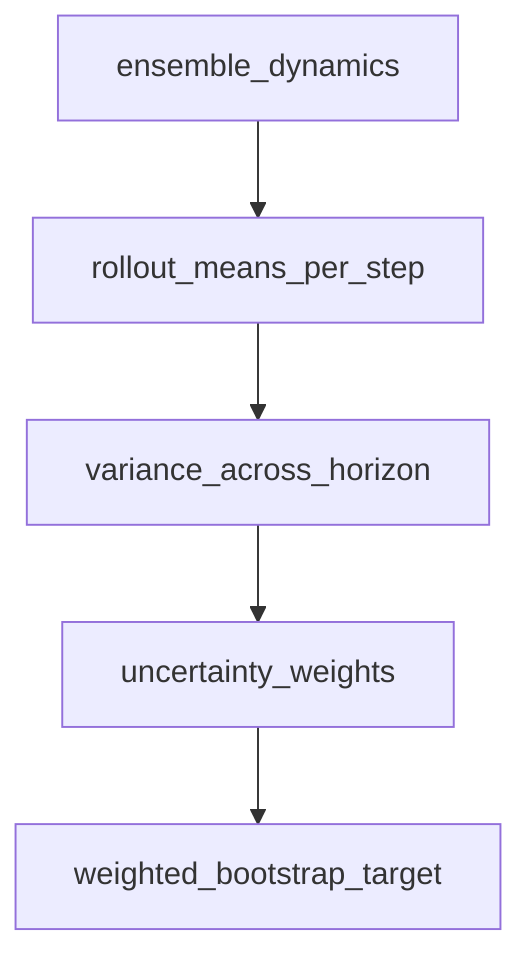

# STEVE (Stochastic Ensemble Value Expansion)

## 1. Overview

**STEVE** (Buckman et al., 2018) extends MVE by **reweighting** multi-horizon value targets using **uncertainty estimates** from an **ensemble** of dynamics models. High-disagreement rollouts are down-weighted to reduce reliance on unreliable model predictions.

Implementation: same trainer as MVE, [`train_mve_steve`](../../src/rl_experiments/advanced/mve_steve/mve_steve_agent.py) with `method="steve"`.

---

## 2. Problem setting

Let $\hat{T}^{(k)}$ be ensemble members. For each horizon segment, model disagreement yields variance $\mathrm{Var}_k[\cdot]$. STEVE uses weights (conceptually) inversely related to variance:


$$
w \propto \frac{1}{\mathrm{Var} + \epsilon},
$$


normalized for stable training.

---

## 3. Intuition

- If ensembles disagree on imagined reward, the model is **uncertain** in that region; **down-weight** that imagined return.
- This mitigates **compounding error** in model-based value expansion.

---

## 4. Mathematical formulation (this code)

The implementation uses per-step reward means from the ensemble, then computes variance across time steps for weighting:

```python
var = torch.stack(means, dim=0).var(dim=0) + 1e-6
weight = 1.0 / var
weight = weight / weight.mean()
target = g + tail * weight
```

This is a **practical** STEVE-style heuristic; see paper for full mixture-of-targets view.

---

## 5. Architecture



---

## 6. References

1. Buckman, J., et al. (2018). *Sample-Efficient Reinforcement Learning with Stochastic Ensemble Value Expansion.* NeurIPS.

---

## Appendix: Pseudocode and formal notes

Notation: [`00_notation_and_conventions.md`](00_notation_and_conventions.md). Ensembles: [`theoretical_appendix_model_based.md`](theoretical_appendix_model_based.md).

### A. Pseudocode (ensemble disagreement weights targets)

```text
Train ensemble {Ĉ^(i)}; for each (s,a) rollout k steps per member or sample members
Compute imagined return paths; measure cross-ensemble variance W_t along horizon
Form target mixing model-based return and bootstrap using weights that **down-weight** high-disagreement steps
Update value / policy with weighted targets
```

### B. Assumptions (informal)

**A1 (disagreement ↔ error).** Ensemble variance is a **proxy** for epistemic uncertainty, not calibrated in general.

**A2 (weighting scheme).** STEVE’s mixture reduces **sensitivity** to bad rollouts but can **underuse** the model where ensembles falsely agree.

### C. Remarks

- STEVE is closely related to MVE with **uncertainty-aware** target construction; see paper for the exact **interpolation** between $H$-step model return and $k$-step expansions.
- Tuning ensemble **diversity** (initialization, data, arch) affects the quality of $W_t$.
