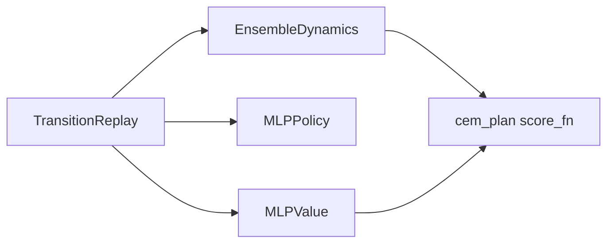

# TD-MPC (Latent planning with value backup)

## 1. Overview

**TD-MPC** (Hansen et al., 2022) learns latent dynamics together with a **terminal value** and uses **short-horizon planning** (often CEM) to choose actions, with TD-style value backups. This repository implements a **continuous-control** variant in [`train_tdmpc`](../../src/rl_experiments/advanced/tdmpc/tdmpc_agent.py) with `variant="tdmpc"`.

---

## 2. Problem setting

Let dynamics be approximated by an ensemble $\mathcal{E}_\phi$, policy $\pi_\theta$, and value $V_\psi$. Planning maximizes approximate cumulative reward:


$$
\max_{a_{0:H-1}} \mathbb{E}\Big[\sum_{t=0}^{H-1} \gamma^t \hat{r}_t + \gamma^H V_\psi(s_H)\Big],
$$


with $\hat{r}_t, s_{t+1}$ produced by rolling the learned model forward from current state $s_0$.

---

## 3. Intuition

- Combines **model-based rollouts** with **value function** to limit horizon error.
- CEM searches action sequences that score well under ensemble dynamics.

---

## 4. Mathematical formulation (training)

The training loop fits:

1. **Dynamics:** MSE of predicted $(\Delta s, r)$ vs transitions in replay.
2. **Value:** regression to **model-based rollout targets** (see code).
3. **Policy:** auxiliary term encouraging stable action outputs (implementation-specific).

---

## 5. Architecture



---

## 6. Code anchor

```python
horizon = 8 if variant == "tdmpc2" else 5
gamma = 0.995 if variant == "tdmpc2" else 0.99
def score_fn(action_seq):
    return cem_score_ensemble_dynamics(dyn, obs_np, obs_dim, device, action_seq, gamma, value_fn=value)
a0 = cem_plan(score_fn, horizon=horizon, action_dim=action_dim, n_samples=64, n_iters=3)
```

---

## 7. References

1. Hansen, N., Su, H., & Wang, X. (2022). *Temporal Difference Learning for Model Predictive Control.* ICML.

---

## Appendix: Pseudocode and formal notes

Notation: [`00_notation_and_conventions.md`](00_notation_and_conventions.md). Model rollouts: [`theoretical_appendix_model_based.md`](theoretical_appendix_model_based.md).

### A. Pseudocode (model + TD terminal value + MPC)

```text
Learn dynamics, reward, and terminal value V_ψ (latent or state)
At each control step:
  CEM over action sequences; simulate with ensemble dynamics
  Score: Σ γ^t r_t + γ^H V(s_H) (or latent analogue)
  Execute first action; update model and V with TD targets from real transitions
```

### B. Assumptions (informal)

**A1 (value as terminal cost).** $V_\psi$ must **summarize** beyond-horizon return; bias in $V$ biases MPC.

**A2 (differentiability / latent).** TD-MPC variants exploit **differentiable** trajectory optimization in some implementations; this repo may use CEM scoring.

**A3 (horizon).** Horizon $H$ in code trades **lookahead** vs **model error** (see `tdmpc2.md` for longer variant).

### C. Remarks

- Connecting **TD backups** to **MPC** couples model-based planning with **critic** learning; miscalibrated dynamics hurt both.
