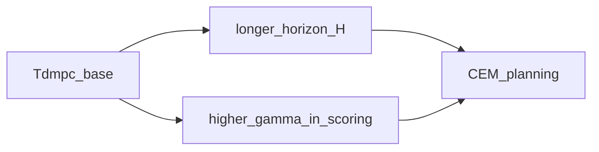

# TD-MPC2

## 1. Overview

**TD-MPC2** (Hansen et al., 2023) extends TD-MPC with improved **representation learning**, **multi-task** structure, and more stable **latent planning** in the reference implementation. In **this repository**, `tdmpc2` is exposed as a **variant flag** on the same trainer as TD-MPC: it uses a **longer planning horizon** and **slightly higher discount** during CEM scoring (see [`tdmpc_agent.py`](../../src/rl_experiments/advanced/tdmpc/tdmpc_agent.py)).

---

## 2. Relation to TD-MPC

| Aspect | `tdmpc` | `tdmpc2` (this repo) |
|--------|---------|----------------------|
| Planning horizon | 5 | 8 |
| $\gamma$ in CEM score | 0.99 | 0.995 |
| Code path | `train_tdmpc(..., variant="tdmpc")` | `variant="tdmpc2"` |

This mirrors the idea of **more aggressive planning / longer lookahead** without importing the full multi-task TD-MPC2 codebase.



```python
horizon = 8 if variant == "tdmpc2" else 5
gamma = 0.995 if variant == "tdmpc2" else 0.99
```

---

## 3. Mathematical note

The CEM objective remains an approximate **finite-horizon return** with terminal value:


$$
\max_{a_{0:H-1}} \sum_{t=0}^{H-1} \gamma^t \hat{r}_t + \gamma^H V(s_H).
$$


Increasing $H$ and $\gamma$ shifts emphasis toward **longer-horizon credit assignment** (use with care: model error compounds).

---

## 4. References

1. Hansen, N., et al. (2023). *TD-MPC2: Scalable, Robust World Models for Continuous Control.* arXiv:2310.16828.

---

## Appendix: Pseudocode and formal notes

Notation: [`00_notation_and_conventions.md`](00_notation_and_conventions.md). Compounding error: [`theoretical_appendix_model_based.md`](theoretical_appendix_model_based.md).

### A. Pseudocode (vs TD-MPC in this repo)

Same **CEM + ensemble rollout** template as TD-MPC; differences are **hyperparameters** (e.g. longer `horizon`, $\gamma$ closer to 1) that increase **credit assignment depth** and **sensitivity** to model error.

### B. Assumptions (informal)

**A1.** Longer horizons assume the **world model + value** pair remains informative over $H$ steps in the visited region.

**A2.** Higher $\gamma$ amplifies **errors** in long-term return estimates from both model and critic.

### C. Remarks

- Treat TD-MPC2 here as a **configuration axis** on the same family; verify `run_all` / agent defaults for exact numbers.
- If training destabilizes, reduce horizon or increase **ensemble** diversity before tuning learning rates.
