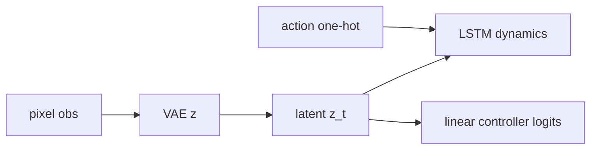

# World Models (Ha & Schmidhuber)

## 1. Overview

The **World Models** paradigm (Ha & Schmidhuber, 2018) learns a **compressed latent representation** of observations, a **recurrent dynamics model** in latent space, and a **controller** that maximizes return using imagined rollouts. The original work uses a **VAE** for vision, an **MDN-RNN** for sequence modeling, and a **controller** (e.g. CMA-ES) in latent space.

This repository implements a **simplified** pipeline in [`train_world_models`](../../src/rl_experiments/advanced/world_models/world_models_agent.py): **VAE** + **LSTM** + a **linear controller** on discrete actions for pixel observations.

---

## 2. Problem setting

Let encoder produce latent $z_t$ from observation $o_t$. A recurrent model predicts $z_{t+1}$ given $(z_t, a_t)$. A controller maps $z_t$ to action logits.

---

## 3. Intuition

- If the environment is **partially observable**, a latent state can summarize history.
- Training in **latent imagination** can reduce sample complexity.

---

## 4. Mathematical formulation (conceptual)

- **VAE ELBO:** $\mathbb{E}_{q_\phi(z|o)}[\log p_\theta(o|z)] - \lambda\, KL(q_\phi(z|o)\,\|\,p(z))$.
- **Sequence model:** minimize next-latent prediction error (here LSTM + linear head rather than full MDN mixture in the simplified code).
- **Controller:** policy gradient / cross-entropy toward returns (see training loop).

---

## 5. Architecture



---

## 6. Code anchor

```python
vae = VAE().to(device)
rnn = nn.LSTM(input_size=32 + n_actions, hidden_size=128, num_layers=1).to(device)
ctrl = nn.Linear(32, n_actions).to(device)
```

---

## 7. Limitations

- Not a full reproduction of the MDN-RNN mixture or CMA-ES controller from the paper.
- Intended as an **educational** latent-sequence modeling baseline.

---

## 8. References

1. Ha, D., & Schmidhuber, J. (2018). *World Models.* arXiv:1803.10122.

---

## Appendix: Pseudocode and formal notes

Notation: [`00_notation_and_conventions.md`](00_notation_and_conventions.md). Latent dynamics: [`theoretical_appendix_model_based.md`](theoretical_appendix_model_based.md).

### A. Pseudocode (VAE + MDN-RNN + controller, schematic)

```text
VAE: encode frame → z_t; decode z_t → reconstruct observation
RNN: update hidden h_t from (z_t, a_{t−1}); MDN predicts distribution of z_{t+1}
Controller: policy π(a_t | z_t, h_t) trained in **latent rollouts** (often with ES / policy search)
Real env used periodically to reduce simulator–reality gap
```

### B. Assumptions (informal)

**A1 (Markov in latent space).** Planning assumes **rollouts in z** approximate the true MDP’s returns.

**A2 (simulator gap).** Pure imagination training can **overfit** the learned model; real interaction is necessary.

**A3 (optimization).** Evolution strategies on latent policies have **high variance**; sample complexity scales with controller dimension.

### C. Remarks

- This repo’s implementation may **simplify** MDN-RNN and ES relative to the original blog/paper pipeline.
- World Models historically demonstrated **qualitative** “dreaming” behavior; quantitative benchmarks depend on model fidelity.
