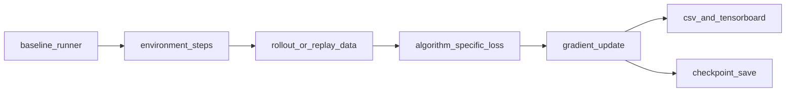

# Baseline Algorithms (Phase 1 and 2)

This page is a **concise overview** and comparison. For **full academic-style treatment** (MDP notation, objectives, equations, and code anchors), use the per-algorithm pages in [`algorithms/index.md`](algorithms/index.md).

Baseline algorithms are split into two groups:
- **SB3 implementations**: PPO, SAC, DQN
- **Custom DQN family**: Double DQN, PER-DQN, Rainbow

Deep pages:
- [PPO](algorithms/ppo.md), [SAC](algorithms/sac.md), [DQN](algorithms/dqn.md)
- [Double DQN](algorithms/double_dqn.md), [PER-DQN](algorithms/per_dqn.md), [Rainbow](algorithms/rainbow.md)

## Baseline comparison chart

| Algorithm | Family | On/Off policy | Action space | Replay | Core stabilization |
|---|---|---|---|---|---|
| PPO | policy gradient | on-policy | discrete/continuous | no | clipped objective + GAE |
| SAC | actor-critic | off-policy | continuous | yes | twin-Q + entropy temperature |
| DQN | value-based | off-policy | discrete | yes | target network + epsilon-greedy |
| Double DQN | DQN variant | off-policy | discrete | yes | decoupled action selection/evaluation |
| PER-DQN | DQN variant | off-policy | discrete | prioritized | TD-error weighted replay |
| Rainbow | DQN variant | off-policy | discrete | prioritized | Double + Dueling + PER + n-step + Noisy + C51 |

## Training flow (baseline pipeline)



## Implementation anchors

- SB3 runners:
  - `src/rl_experiments/baselines/ppo_experiment.py`
  - `src/rl_experiments/baselines/sac_experiment.py`
  - `src/rl_experiments/baselines/dqn_experiment.py`
- Custom DQN-family core:
  - `src/rl_experiments/baselines/dqn_variants.py`
- Dispatch layer:
  - `src/rl_experiments/api/registry.py`

## Code segments

```python
# SB3 baseline pattern
model = PPO("MlpPolicy", vec_env, seed=seed, **PPO_CONFIG)
model.learn(total_timesteps=total_timesteps, callback=cb, progress_bar=True)
```

```python
# Double DQN target logic in dqn_variants.py
next_a = net(b_nobs).argmax(dim=1, keepdim=True)
next_q = tgt(b_nobs).gather(1, next_a).squeeze(1)
target = b_rew + (1.0 - b_done) * (cfg.gamma ** n_step) * next_q
```

## Phase 2 variance analysis

`src/rl_experiments/experiments/compare_phase1.py` runs multi-seed comparisons and generates mean-plus-variance plots. This is critical for RL because single-seed conclusions are often unstable.
